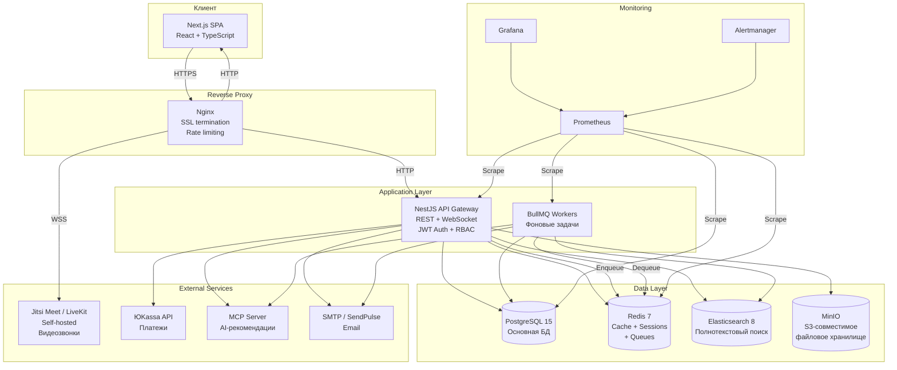
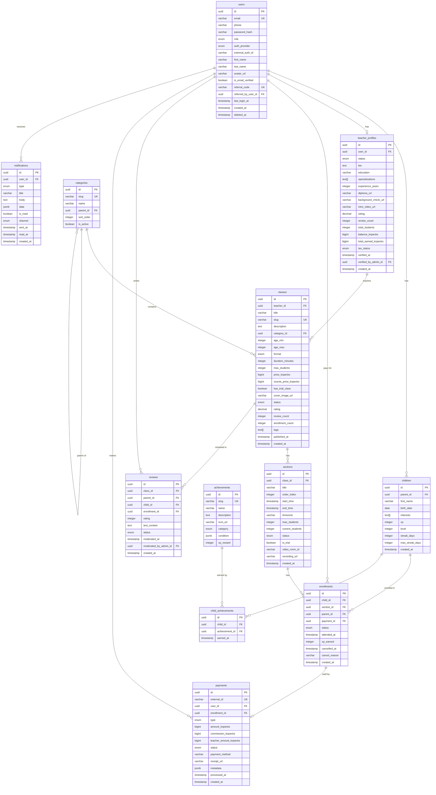
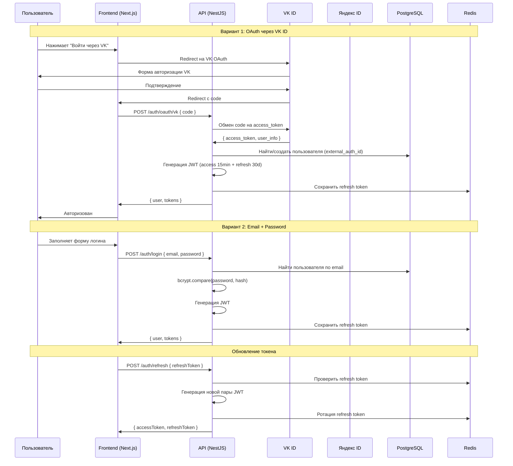
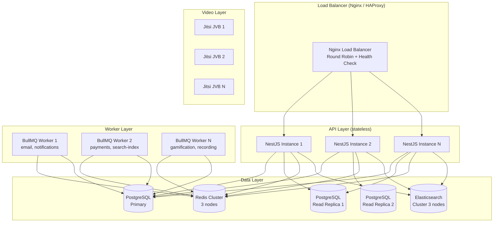

# Архитектура: Маркетплейс онлайн-классов для детей (Outschool RU)

## 1. Обзор архитектуры

### 1.1. Архитектурный паттерн

**Distributed Monolith (Распределённый монолит)** в монорепозитории. Все модули живут в одном репозитории (`packages/*`), деплоятся как отдельные Docker-контейнеры, но разделяют общие типы и утилиты через shared-пакет. Это даёт баланс между простотой монолита и возможностью независимого масштабирования отдельных компонентов.

### 1.2. Принципы

1. **Монорепо с чёткими границами** — каждый пакет имеет собственный `package.json`, но типы и утилиты шарятся
2. **API-first** — все взаимодействия через REST API с OpenAPI-спецификацией
3. **Infrastructure as Code** — вся инфраструктура описана в `docker-compose.yml`
4. **Security by Default** — 152-ФЗ, шифрование, RBAC на каждом уровне
5. **Observability** — логи, метрики, трейсинг для каждого компонента

---

## 2. Диаграмма высокого уровня



---

## 3. Структура монорепозитория

```
outschool-ru/
├── packages/
│   ├── web/                          # Next.js фронтенд
│   │   ├── src/
│   │   │   ├── app/                  # App Router (Next.js 14+)
│   │   │   │   ├── (auth)/           # Группа: регистрация, логин
│   │   │   │   ├── (main)/           # Группа: каталог, профиль
│   │   │   │   │   ├── classes/      # Каталог и карточки классов
│   │   │   │   │   ├── search/       # Страница поиска
│   │   │   │   │   ├── dashboard/    # Дашборд родителя / преподавателя
│   │   │   │   │   └── profile/      # Профили
│   │   │   │   ├── (admin)/          # Группа: админ-панель
│   │   │   │   └── (video)/          # Группа: видеокомнаты
│   │   │   ├── components/
│   │   │   │   ├── ui/               # UI-kit (кнопки, формы, модалки)
│   │   │   │   ├── layout/           # Header, Footer, Sidebar
│   │   │   │   ├── classes/          # Компоненты классов
│   │   │   │   ├── video/            # Видеоплеер, управление комнатой
│   │   │   │   └── gamification/     # Бейджи, прогресс-бар, уровни
│   │   │   ├── hooks/                # React hooks
│   │   │   ├── store/                # Zustand stores
│   │   │   ├── lib/                  # API client, utils
│   │   │   └── styles/               # Global CSS, Tailwind config
│   │   ├── public/                   # Статика (иконки, шрифты)
│   │   ├── next.config.js
│   │   ├── tailwind.config.ts
│   │   ├── tsconfig.json
│   │   └── package.json
│   │
│   ├── api/                          # NestJS бэкенд
│   │   ├── src/
│   │   │   ├── main.ts               # Точка входа
│   │   │   ├── app.module.ts         # Корневой модуль
│   │   │   ├── common/
│   │   │   │   ├── guards/           # AuthGuard, RolesGuard
│   │   │   │   ├── decorators/       # @Roles, @CurrentUser
│   │   │   │   ├── interceptors/     # Logging, Transform
│   │   │   │   ├── filters/          # Exception filters
│   │   │   │   ├── pipes/            # Validation pipe
│   │   │   │   └── middleware/        # Rate limit, CORS
│   │   │   ├── modules/
│   │   │   │   ├── auth/
│   │   │   │   │   ├── auth.module.ts
│   │   │   │   │   ├── auth.controller.ts
│   │   │   │   │   ├── auth.service.ts
│   │   │   │   │   ├── strategies/   # JWT, VK, Yandex strategies
│   │   │   │   │   └── dto/
│   │   │   │   ├── users/
│   │   │   │   ├── children/
│   │   │   │   ├── teachers/
│   │   │   │   ├── classes/
│   │   │   │   ├── sections/
│   │   │   │   ├── enrollments/
│   │   │   │   ├── payments/
│   │   │   │   │   ├── payments.service.ts
│   │   │   │   │   ├── yukassa.service.ts  # Интеграция с ЮKassa
│   │   │   │   │   └── webhook.controller.ts
│   │   │   │   ├── reviews/
│   │   │   │   ├── achievements/
│   │   │   │   ├── notifications/
│   │   │   │   ├── search/
│   │   │   │   │   ├── search.service.ts   # Elasticsearch интеграция
│   │   │   │   │   └── indices/            # Определения индексов
│   │   │   │   ├── recommendations/
│   │   │   │   ├── admin/
│   │   │   │   └── media/            # Загрузка файлов в MinIO
│   │   │   ├── database/
│   │   │   │   ├── migrations/       # TypeORM миграции
│   │   │   │   ├── seeds/            # Начальные данные (категории, бейджи)
│   │   │   │   └── entities/         # TypeORM entities
│   │   │   └── config/               # Конфигурация (env, validation)
│   │   ├── test/
│   │   │   ├── unit/
│   │   │   ├── integration/
│   │   │   └── e2e/
│   │   ├── tsconfig.json
│   │   └── package.json
│   │
│   ├── shared/                       # Общие типы и утилиты
│   │   ├── src/
│   │   │   ├── types/                # TypeScript-типы (User, Class, etc.)
│   │   │   ├── constants/            # Enum'ы, коды ошибок
│   │   │   ├── validators/           # Zod/class-validator схемы
│   │   │   └── utils/                # Общие утилиты (форматирование дат, денег)
│   │   ├── tsconfig.json
│   │   └── package.json
│   │
│   ├── video/                        # Обёртка над видеосервисом
│   │   ├── src/
│   │   │   ├── jitsi/                # Jitsi Meet API wrapper
│   │   │   ├── livekit/              # LiveKit API wrapper (альтернатива)
│   │   │   ├── room.service.ts       # Управление комнатами
│   │   │   └── recording.service.ts  # Управление записями
│   │   ├── tsconfig.json
│   │   └── package.json
│   │
│   ├── ai/                           # MCP AI-сервис
│   │   ├── src/
│   │   │   ├── mcp-server.ts         # MCP server (Model Context Protocol)
│   │   │   ├── recommendations/      # Движок рекомендаций
│   │   │   │   ├── collaborative.ts  # Collaborative filtering
│   │   │   │   ├── content-based.ts  # Content-based filtering
│   │   │   │   └── hybrid.ts         # Гибридный алгоритм
│   │   │   ├── matching/             # Teacher-student matching
│   │   │   └── embeddings/           # Векторные эмбеддинги (future)
│   │   ├── tsconfig.json
│   │   └── package.json
│   │
│   └── workers/                      # Фоновые задачи (BullMQ)
│       ├── src/
│       │   ├── queues/
│       │   │   ├── email.queue.ts    # Отправка email
│       │   │   ├── notification.queue.ts
│       │   │   ├── payment.queue.ts  # Обработка платежей
│       │   │   ├── search-index.queue.ts  # Индексация в ES
│       │   │   ├── gamification.queue.ts  # Начисление XP/бейджей
│       │   │   └── recording.queue.ts     # Обработка видеозаписей
│       │   └── processors/           # Обработчики очередей
│       ├── tsconfig.json
│       └── package.json
│
├── docker/
│   ├── nginx/
│   │   └── nginx.conf                # Конфигурация reverse proxy
│   ├── jitsi/                        # Конфигурация Jitsi Meet
│   ├── postgres/
│   │   └── init.sql                  # Инициализация БД
│   └── elasticsearch/
│       └── config.yml
│
├── docker-compose.yml                # Основной compose-файл
├── docker-compose.dev.yml            # Оверлей для разработки
├── docker-compose.prod.yml           # Оверлей для продакшена
├── Dockerfile                        # Multi-stage Dockerfile
├── .env.example
├── turbo.json                        # Turborepo конфигурация
├── package.json                      # Root package.json (workspaces)
├── tsconfig.base.json                # Базовый TS-конфиг
└── .gitignore
```

---

## 4. Стек технологий

| Компонент | Технология | Версия | Обоснование выбора |
|-----------|-----------|--------|-------------------|
| **Frontend framework** | Next.js (React) | 14.x | SSR/SSG для SEO, App Router, отличная экосистема React, Server Components для производительности |
| **Frontend язык** | TypeScript | 5.x | Строгая типизация, единый язык с бэкендом, шаренные типы через shared-пакет |
| **Стилизация** | Tailwind CSS + shadcn/ui | 3.x | Быстрая разработка UI, консистентный дизайн, отличная документация |
| **State management** | Zustand | 4.x | Простой, легковесный, без бойлерплейта Redux |
| **Backend framework** | NestJS | 10.x | Модульная архитектура, DI-контейнер, декораторы, TypeORM интеграция, OpenAPI генерация |
| **Backend язык** | TypeScript | 5.x | Единый язык со фронтендом, строгая типизация |
| **ORM** | TypeORM | 0.3.x | Зрелая ORM для NestJS, миграции, декораторы для entities, поддержка PostgreSQL |
| **Валидация** | class-validator + class-transformer | — | Нативная интеграция с NestJS, декларативная валидация DTO |
| **Основная БД** | PostgreSQL | 15.x | Надёжная реляционная БД, JSON-поддержка, полнотекстовый поиск (fallback), расширения (uuid-ossp, pgcrypto) |
| **Кэш / Сессии / Очереди** | Redis | 7.x | In-memory скорость, поддержка pub/sub, BullMQ очереди, кэширование, хранение сессий |
| **Очереди задач** | BullMQ | 4.x | Redis-based, надёжная доставка, retry-логика, UI-дашборд (Bull Board), приоритеты |
| **Поиск** | Elasticsearch | 8.x | Полнотекстовый поиск с морфологией русского языка, фасетный поиск, автодополнение, агрегации. Альтернатива: Meilisearch (проще, но менее гибко) |
| **Видеозвонки** | Jitsi Meet (self-hosted) | latest | Open-source, self-hosted (контроль данных для 152-ФЗ), WebRTC, запись, модерация. Альтернатива: LiveKit (более современный SFU) |
| **Файловое хранилище** | MinIO | latest | S3-совместимый, self-hosted, подходит для 152-ФЗ (данные на территории РФ) |
| **Платежи** | ЮKassa (ex. Яндекс.Касса) | API v3 | Основной платёжный шлюз в РФ, поддержка карт/SBP/YooMoney, онлайн-кассы (54-ФЗ), сплит-платежи |
| **Аутентификация** | Passport.js + JWT | — | VK ID OAuth2, Яндекс ID OAuth2, email+password (bcrypt), JWT access+refresh tokens |
| **AI/ML** | MCP Server (Node.js) | — | Model Context Protocol для AI-рекомендаций, standalone сервис, возможность подключения LLM |
| **Reverse proxy** | Nginx | 1.25.x | SSL termination, rate limiting, static file serving, WebSocket proxy |
| **Контейнеризация** | Docker + Docker Compose | 24.x / 2.x | Изоляция сервисов, воспроизводимые окружения, простой деплой |
| **Монорепо-менеджер** | Turborepo | 1.x | Быстрые параллельные билды, кэширование, dependency graph |
| **CI/CD** | GitHub Actions | — | Автоматизация тестов, линтинга, билда, деплоя |
| **Мониторинг** | Prometheus + Grafana | — | Метрики, дашборды, алерты |
| **Логирование** | Winston + Loki | — | Структурированные логи (JSON), агрегация через Loki, визуализация в Grafana |
| **Инфраструктура** | VPS (AdminVPS/HOSTKEY) | — | Российские датацентры для 152-ФЗ, доступная цена, выделенные ресурсы |

---

## 5. Архитектура данных

### 5.1. Схема PostgreSQL (основные таблицы и связи)



### 5.2. Индексы PostgreSQL (ключевые)

```sql
-- Users
CREATE UNIQUE INDEX idx_users_email ON users(email) WHERE deleted_at IS NULL;
CREATE UNIQUE INDEX idx_users_referral_code ON users(referral_code);
CREATE INDEX idx_users_role ON users(role);
CREATE INDEX idx_users_auth_provider ON users(auth_provider, external_auth_id);

-- Children
CREATE INDEX idx_children_parent_id ON children(parent_id);

-- Teacher Profiles
CREATE INDEX idx_teacher_profiles_user_id ON teacher_profiles(user_id);
CREATE INDEX idx_teacher_profiles_status ON teacher_profiles(status);
CREATE INDEX idx_teacher_profiles_rating ON teacher_profiles(rating DESC);

-- Classes
CREATE INDEX idx_classes_teacher_id ON classes(teacher_id);
CREATE INDEX idx_classes_category_id ON classes(category_id);
CREATE INDEX idx_classes_status ON classes(status);
CREATE INDEX idx_classes_status_published ON classes(published_at DESC)
  WHERE status = 'published';
CREATE INDEX idx_classes_age_range ON classes(age_min, age_max)
  WHERE status = 'published';
CREATE INDEX idx_classes_price ON classes(price_kopecks)
  WHERE status = 'published';
CREATE INDEX idx_classes_rating ON classes(rating DESC)
  WHERE status = 'published';
CREATE INDEX idx_classes_slug ON classes(slug);

-- Sections
CREATE INDEX idx_sections_class_id ON sections(class_id);
CREATE INDEX idx_sections_start_time ON sections(start_time)
  WHERE status = 'scheduled';
CREATE INDEX idx_sections_available ON sections(class_id, start_time)
  WHERE status = 'scheduled' AND current_students < max_students;

-- Enrollments
CREATE INDEX idx_enrollments_child_id ON enrollments(child_id);
CREATE INDEX idx_enrollments_section_id ON enrollments(section_id);
CREATE INDEX idx_enrollments_parent_id ON enrollments(parent_id);
CREATE INDEX idx_enrollments_status ON enrollments(status);
CREATE UNIQUE INDEX idx_enrollments_unique ON enrollments(child_id, section_id)
  WHERE status NOT IN ('cancelled', 'refunded');

-- Reviews
CREATE INDEX idx_reviews_class_id ON reviews(class_id) WHERE status = 'published';
CREATE INDEX idx_reviews_parent_id ON reviews(parent_id);
CREATE INDEX idx_reviews_status ON reviews(status);

-- Payments
CREATE UNIQUE INDEX idx_payments_external_id ON payments(external_id);
CREATE INDEX idx_payments_user_id ON payments(user_id);
CREATE INDEX idx_payments_enrollment_id ON payments(enrollment_id);
CREATE INDEX idx_payments_status ON payments(status);
CREATE INDEX idx_payments_created_at ON payments(created_at DESC);

-- Notifications
CREATE INDEX idx_notifications_user_id ON notifications(user_id, is_read, created_at DESC);
```

### 5.3. Использование Redis

| Назначение | Ключ (паттерн) | TTL | Описание |
|-----------|---------------|-----|----------|
| **Сессии** | `session:{userId}` | 30 дней | Refresh tokens и метаданные сессий |
| **Кэш классов** | `class:{classId}` | 5 мин | Кэширование карточки класса (горячие данные) |
| **Кэш каталога** | `catalog:{hash(filters)}` | 2 мин | Результаты запросов каталога |
| **Кэш профиля преподавателя** | `teacher:{teacherId}` | 10 мин | Профиль с рейтингом и статистикой |
| **Rate limiting** | `ratelimit:{ip}:{endpoint}` | 1 мин | Счётчик запросов для rate limiter |
| **Видеокомнаты** | `room:{sectionId}` | до конца занятия | Метаданные активной видеокомнаты |
| **Очереди BullMQ** | `bull:{queueName}:*` | — | Задачи фоновых обработчиков |
| **Рекомендации** | `recs:{childId}` | 1 час | Кэш AI-рекомендаций |
| **Онлайн-статус** | `online:{userId}` | 5 мин (heartbeat) | Кто сейчас на платформе |
| **Счётчики** | `counter:dau:{date}` | 48 часов | Счётчики DAU для аналитики |

### 5.4. Индексы Elasticsearch

```json
// Индекс: classes
{
  "mappings": {
    "properties": {
      "id": { "type": "keyword" },
      "title": {
        "type": "text",
        "analyzer": "russian_morphology",
        "fields": {
          "keyword": { "type": "keyword" },
          "suggest": {
            "type": "completion",
            "analyzer": "russian_morphology"
          }
        }
      },
      "description": {
        "type": "text",
        "analyzer": "russian_morphology"
      },
      "shortDescription": {
        "type": "text",
        "analyzer": "russian_morphology"
      },
      "categoryId": { "type": "keyword" },
      "categoryName": {
        "type": "text",
        "analyzer": "russian_morphology",
        "fields": { "keyword": { "type": "keyword" } }
      },
      "teacherId": { "type": "keyword" },
      "teacherName": {
        "type": "text",
        "fields": { "keyword": { "type": "keyword" } }
      },
      "tags": {
        "type": "text",
        "analyzer": "russian_morphology",
        "fields": { "keyword": { "type": "keyword" } }
      },
      "ageMin": { "type": "integer" },
      "ageMax": { "type": "integer" },
      "format": { "type": "keyword" },
      "durationMinutes": { "type": "integer" },
      "maxStudents": { "type": "integer" },
      "priceKopecks": { "type": "long" },
      "hasTrialClass": { "type": "boolean" },
      "status": { "type": "keyword" },
      "rating": { "type": "float" },
      "reviewCount": { "type": "integer" },
      "enrollmentCount": { "type": "integer" },
      "publishedAt": { "type": "date" },
      "nextSectionStartTime": { "type": "date" },
      "availableSpots": { "type": "integer" }
    }
  },
  "settings": {
    "analysis": {
      "analyzer": {
        "russian_morphology": {
          "type": "custom",
          "tokenizer": "standard",
          "filter": [
            "lowercase",
            "russian_stop",
            "russian_stemmer",
            "synonym_filter"
          ]
        }
      },
      "filter": {
        "russian_stop": {
          "type": "stop",
          "stopwords": "_russian_"
        },
        "russian_stemmer": {
          "type": "stemmer",
          "language": "russian"
        },
        "synonym_filter": {
          "type": "synonym",
          "synonyms": [
            "программирование, кодинг, coding",
            "математика, матан, матеша",
            "английский, инглиш, english"
          ]
        }
      }
    },
    "number_of_shards": 1,
    "number_of_replicas": 1
  }
}
```

---

## 6. Архитектура безопасности

### 6.1. Аутентификация



### 6.2. RBAC (Role-Based Access Control)

| Ресурс / Действие | Parent | Teacher | Admin |
|-------------------|--------|---------|-------|
| Просмотр каталога классов | R | R | R |
| Создание класса | - | CRU | CRUD |
| Публикация класса (модерация) | - | - | U |
| Запись ребёнка на класс | CRU | - | CRUD |
| Проведение видеозанятия | - | R (свои) | R |
| Просмотр прогресса ребёнка | R (свои) | R (свои ученики) | R |
| Оставить отзыв | C | - | RUD |
| Финансы — просмотр | R (свои) | R (свои) | R |
| Вывод средств | - | CU | - |
| Модерация преподавателей | - | - | RU |
| Модерация отзывов | - | - | RUD |
| Аналитика / Дашборд | - | R (свои) | R |
| Управление пользователями | - | - | CRUD |

**Реализация:**

```typescript
// NestJS Guard
@Injectable()
export class RolesGuard implements CanActivate {
  canActivate(context: ExecutionContext): boolean {
    const requiredRoles = this.reflector.get<UserRole[]>('roles', context.getHandler());
    if (!requiredRoles) return true;

    const request = context.switchToHttp().getRequest();
    const user = request.user; // из JWT
    return requiredRoles.includes(user.role);
  }
}

// Использование
@Roles(UserRole.TEACHER)
@UseGuards(AuthGuard, RolesGuard)
@Post('classes')
createClass(@Body() dto: CreateClassDto, @CurrentUser() user: User) { ... }
```

### 6.3. Шифрование данных

| Уровень | Технология | Применение |
|---------|-----------|-----------|
| **In transit** | TLS 1.3 (Nginx) | Все HTTP/WebSocket/API соединения |
| **At rest (БД)** | PostgreSQL TDE или pgcrypto | Конфиденциальные поля: phone, passport data |
| **At rest (файлы)** | MinIO server-side encryption (SSE-S3) | Документы преподавателей, видеозаписи |
| **Secrets** | Docker secrets / env vars | API ключи, пароли БД, JWT secret |
| **Passwords** | bcrypt (cost factor 12) | Хеширование паролей пользователей |
| **Tokens** | JWT RS256 (asymmetric) | Подпись access/refresh tokens |

### 6.4. Соответствие 152-ФЗ (О персональных данных)

| Требование | Реализация |
|-----------|-----------|
| Хранение ПД на территории РФ | Серверы на AdminVPS/HOSTKEY (датацентры в Москве) |
| Согласие на обработку | Явный чекбокс при регистрации, хранение timestamp согласия |
| Право на доступ к данным | API endpoint GET /api/v1/users/me/data-export |
| Право на удаление | API endpoint DELETE /api/v1/users/me (soft delete + очистка ПД через 30 дней) |
| Реестр оператора ПД | Регистрация в реестре Роскомнадзора |
| Политика обработки ПД | Публичная политика на сайте (/privacy-policy) |
| Журнал обработки ПД | Аудит-лог всех операций с ПД |
| Уведомление об инцидентах | Процедура уведомления Роскомнадзора в течение 24ч |

### 6.5. Защита детей (436-ФЗ)

| Требование | Реализация |
|-----------|-----------|
| Возрастная маркировка контента | Каждый класс имеет ageMin/ageMax, отображается метка (0+, 6+, 12+, 16+) |
| Модерация контента | Все классы проходят модерацию перед публикацией |
| Модерация чата | Автоматический фильтр запрещённых слов в чате видеозанятий |
| Контроль доступа детей | Дети входят только через аккаунт родителя, нет прямых сообщений преподавателю |
| Минимальный сбор данных | От ребёнка собирается только имя и дата рождения |
| Родительский контроль | Все действия ребёнка видны родителю в дашборде |

---

## 7. Стратегия масштабирования

### 7.1. Горизонтальное масштабирование



### 7.2. План масштабирования по этапам

| Этап | DAU | Конфигурация | Серверы |
|------|-----|-------------|---------|
| **MVP (M1-M3)** | ~1 000 | Single server: 1x API, 1x PostgreSQL, 1x Redis, 1x Jitsi | 1 VPS (8 vCPU, 32GB RAM, 500GB SSD) |
| **v1.0 (M4-M6)** | ~5 000 | 2x API (load balanced), 1x PostgreSQL + 1 read replica, Redis, Elasticsearch, 2x Jitsi JVB | 3 VPS |
| **v2.0 (M7-M12)** | ~10 000+ | 3-5x API, PostgreSQL Primary + 2 read replicas, Redis Cluster (3 nodes), ES Cluster (3 nodes), 3-5x Jitsi JVB, CDN | 6-8 VPS + CDN |

### 7.3. Масштабирование базы данных

```
=== Read Replicas ===
Стратегия: все READ-запросы (каталог, поиск, профили) направляются на реплики.
Все WRITE-запросы — на primary.

Реализация (TypeORM):
  DataSource({
    replication: {
      master: { host: 'pg-primary', ... },
      slaves: [
        { host: 'pg-replica-1', ... },
        { host: 'pg-replica-2', ... },
      ],
    }
  })

=== Партиционирование ===
Таблица enrollments — партиционирование по дате (ежемесячно):
  CREATE TABLE enrollments (
    ...
  ) PARTITION BY RANGE (created_at);

  CREATE TABLE enrollments_2026_01
    PARTITION OF enrollments
    FOR VALUES FROM ('2026-01-01') TO ('2026-02-01');

Таблица notifications — партиционирование по дате (ежемесячно) + auto-drop через 90 дней.

=== Connection Pooling ===
PgBouncer перед PostgreSQL:
  - pool_mode = transaction
  - max_client_conn = 1000
  - default_pool_size = 25
```

### 7.4. Масштабирование видеоинфраструктуры

```
=== Jitsi Meet Cluster ===

Архитектура:
  1x Jicofo (Conference Focus) — управляет конференциями
  1x Prosody (XMPP server) — сигнализация
  Nx JVB (Jitsi Videobridge) — медиа-обработка

Масштабирование:
  - Каждый JVB обслуживает ~100-200 одновременных участников
  - Новые JVB добавляются через Docker Compose (docker-compose scale jvb=N)
  - Jicofo автоматически балансирует конференции между JVB
  - Стратегия: RegionBasedBridgeSelectionStrategy (все серверы в одном регионе)

Формула:
  required_jvb = CEIL(concurrent_video_users / 150)

  M3: 100 пользователей → 1 JVB
  M6: 500 пользователей → 4 JVB
  M12: 2000 пользователей → 14 JVB

=== Альтернатива: LiveKit ===
  - SFU (Selective Forwarding Unit) архитектура
  - Лучшая производительность при большом количестве участников
  - Встроенная запись и egress
  - Программный API для управления комнатами
```

### 7.5. CDN и статические ресурсы

```
=== CDN (Selectel CDN / Cloudflare) ===

Что кэшируется через CDN:
  - Статика Next.js (/_next/static/*)         → Cache: 1 year (immutable)
  - Изображения обложек классов (/media/*)    → Cache: 7 days
  - Аватары пользователей (/avatars/*)        → Cache: 1 day
  - Видеозаписи занятий (/recordings/*)       → Cache: 30 days
  - Шрифты и иконки (/fonts/*, /icons/*)      → Cache: 1 year

Что НЕ кэшируется:
  - API-запросы (/api/*)
  - WebSocket-подключения (/ws/*)
  - Видеопотоки в реальном времени

Nginx конфигурация:
  location /_next/static/ {
    proxy_cache static_cache;
    proxy_cache_valid 200 365d;
    add_header Cache-Control "public, max-age=31536000, immutable";
  }
```

---

## 8. Инфраструктура и деплой

### 8.1. Docker Compose (продакшен-конфигурация)

```yaml
# docker-compose.prod.yml (упрощённая схема)
version: "3.9"

services:
  nginx:
    image: nginx:1.25-alpine
    ports:
      - "80:80"
      - "443:443"
    volumes:
      - ./docker/nginx/nginx.conf:/etc/nginx/nginx.conf
      - ./certs:/etc/nginx/certs
    depends_on:
      - web
      - api
    restart: always

  web:
    build:
      context: .
      dockerfile: Dockerfile
      target: web-production
    environment:
      - NEXT_PUBLIC_API_URL=https://api.outschool.ru
    restart: always

  api:
    build:
      context: .
      dockerfile: Dockerfile
      target: api-production
    environment:
      - DATABASE_URL=postgresql://...
      - REDIS_URL=redis://redis:6379
      - ELASTICSEARCH_URL=http://elasticsearch:9200
      - YUKASSA_SHOP_ID=${YUKASSA_SHOP_ID}
      - YUKASSA_SECRET_KEY=${YUKASSA_SECRET_KEY}
      - JWT_SECRET=${JWT_SECRET}
      - MINIO_ENDPOINT=minio:9000
    depends_on:
      - postgres
      - redis
      - elasticsearch
      - minio
    restart: always

  workers:
    build:
      context: .
      dockerfile: Dockerfile
      target: workers-production
    environment:
      - DATABASE_URL=postgresql://...
      - REDIS_URL=redis://redis:6379
    depends_on:
      - postgres
      - redis
    restart: always

  postgres:
    image: postgres:15-alpine
    volumes:
      - postgres_data:/var/lib/postgresql/data
      - ./docker/postgres/init.sql:/docker-entrypoint-initdb.d/init.sql
    environment:
      - POSTGRES_DB=outschool
      - POSTGRES_USER=${DB_USER}
      - POSTGRES_PASSWORD=${DB_PASSWORD}
    restart: always

  redis:
    image: redis:7-alpine
    volumes:
      - redis_data:/data
    command: redis-server --appendonly yes --requirepass ${REDIS_PASSWORD}
    restart: always

  elasticsearch:
    image: elasticsearch:8.12.0
    volumes:
      - es_data:/usr/share/elasticsearch/data
    environment:
      - discovery.type=single-node
      - xpack.security.enabled=false
      - "ES_JAVA_OPTS=-Xms512m -Xmx512m"
    restart: always

  minio:
    image: minio/minio:latest
    volumes:
      - minio_data:/data
    command: server /data --console-address ":9001"
    environment:
      - MINIO_ROOT_USER=${MINIO_USER}
      - MINIO_ROOT_PASSWORD=${MINIO_PASSWORD}
    restart: always

  jitsi-web:
    image: jitsi/web:stable
    # ... Jitsi конфигурация (prosody, jicofo, jvb)

  mcp-ai:
    build:
      context: .
      dockerfile: Dockerfile
      target: ai-production
    environment:
      - DATABASE_URL=postgresql://...
    restart: always

  prometheus:
    image: prom/prometheus:latest
    volumes:
      - ./docker/prometheus/prometheus.yml:/etc/prometheus/prometheus.yml
    restart: always

  grafana:
    image: grafana/grafana:latest
    volumes:
      - grafana_data:/var/lib/grafana
    restart: always

volumes:
  postgres_data:
  redis_data:
  es_data:
  minio_data:
  grafana_data:
```

### 8.2. CI/CD Pipeline (GitHub Actions)

```
Trigger: push to main, pull_request

Pipeline:
  1. Lint (ESLint + Prettier) → параллельно для всех packages
  2. Type check (tsc --noEmit) → параллельно
  3. Unit tests (Jest) → параллельно
  4. Integration tests (Jest + testcontainers) → последовательно
  5. Build Docker images → параллельно
  6. Push images to registry
  7. Deploy:
     - PR → staging (автоматически)
     - main → production (ручное подтверждение)
  8. Post-deploy:
     - Smoke tests
     - Notify Telegram
```

### 8.3. Мониторинг и алерты

| Метрика | Порог алерта | Канал |
|---------|-------------|-------|
| API response time P95 | > 1s (5 мин) | Telegram + email |
| API error rate 5xx | > 1% (5 мин) | Telegram + email |
| PostgreSQL connections | > 80% max | Telegram |
| PostgreSQL replication lag | > 10s | Telegram + email |
| Redis memory usage | > 80% maxmemory | Telegram |
| Elasticsearch cluster health | yellow/red | Telegram + email |
| Disk usage | > 85% | Telegram |
| Video server CPU | > 90% (5 мин) | Telegram |
| SSL certificate expiry | < 14 дней | Email |
| Failed payments rate | > 5% (1 час) | Telegram + email |
| Queue depth (BullMQ) | > 1000 pending (10 мин) | Telegram |

---

## 9. Обработка ошибок и отказоустойчивость

### 9.1. Стратегия retry

| Операция | Retry count | Backoff | Fallback |
|----------|------------|---------|----------|
| Платёж ЮKassa webhook | 3 | Exponential (1s, 5s, 30s) | Dead letter queue → ручная обработка |
| Отправка email | 5 | Exponential (10s, 30s, 1m, 5m, 15m) | Логирование, повтор через 1ч |
| Индексация в Elasticsearch | 3 | Linear (5s) | Очередь переиндексации |
| Создание видеокомнаты | 2 | 3s | Показать ошибку, кнопка "Повторить" |
| AI-рекомендации | 1 | — | Fallback на базовые рекомендации (по категории/возрасту) |

### 9.2. Circuit Breaker

```
Компоненты с Circuit Breaker:
  - ЮKassa API: threshold 5 ошибок за 30с → open 60с
  - Elasticsearch: threshold 3 ошибки за 10с → open 30с → fallback на PostgreSQL LIKE
  - MCP AI Server: threshold 3 ошибки за 10с → open 30с → fallback на простые рекомендации
  - Jitsi/LiveKit API: threshold 2 ошибки за 5с → open 30с
  - SMTP: threshold 5 ошибок за 60с → open 120с → queue для повтора
```

### 9.3. Backup и восстановление

```
=== PostgreSQL ===
  Полный бэкап: ежедневно в 03:00 MSK (pg_basebackup)
  WAL-архивирование: непрерывное (pgBackRest)
  Хранение: 30 дней полных + WAL
  Тестовое восстановление: еженедельно (автоматическое)
  RPO: < 15 минут

=== Redis ===
  AOF: appendonly yes (данные на диске)
  RDB snapshot: каждые 5 минут
  Хранение: 7 дней

=== MinIO ===
  Версионирование бакетов: включено
  Репликация: на второй сервер (future)
  Хранение: бессрочно для медиа, 90 дней для temp

=== Elasticsearch ===
  Snapshot: ежедневно
  Полное восстановление: переиндексация из PostgreSQL (fallback)
```
