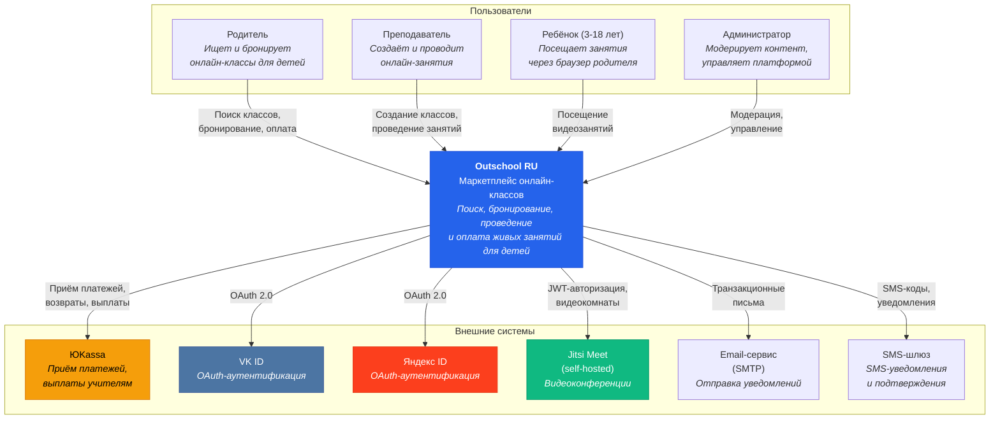
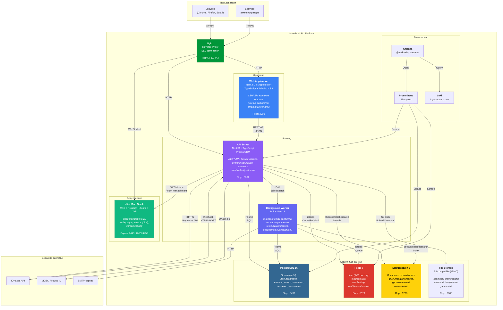
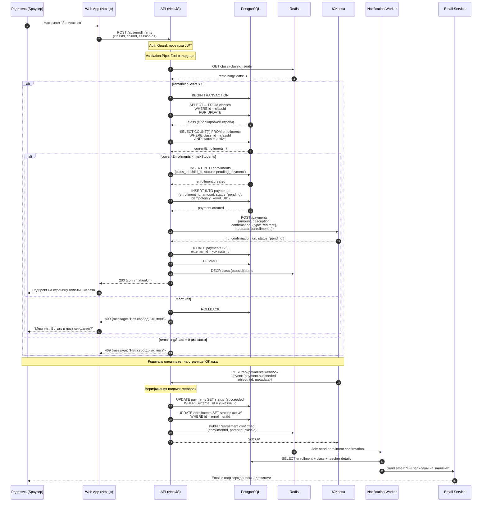
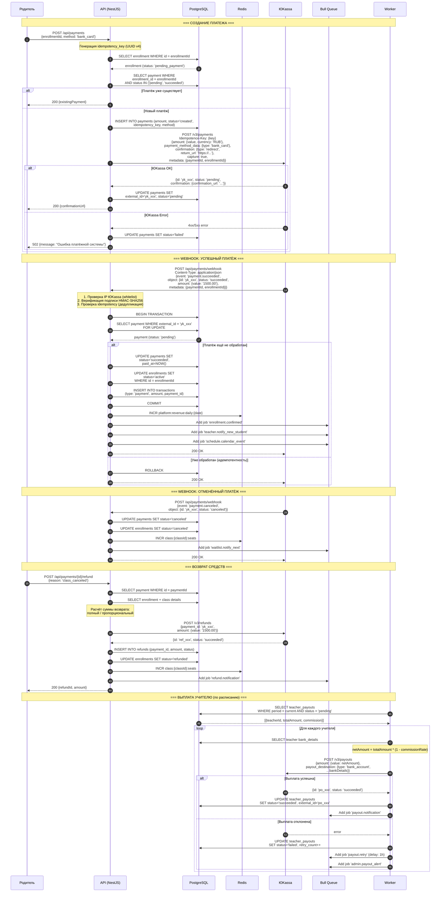
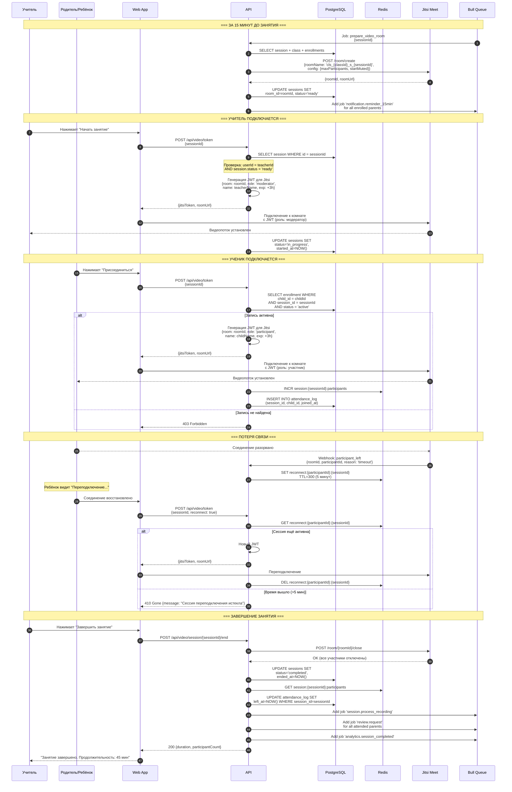

# C4 Architecture Diagrams: Маркетплейс онлайн-классов для детей (Outschool RU)

## C1: Системный контекст (System Context)

Диаграмма верхнего уровня показывает платформу и её взаимодействие с пользователями и внешними системами.

---

## C2: Диаграмма контейнеров (Container Diagram)

Показывает внутреннюю структуру платформы: основные контейнеры (приложения/сервисы) и их взаимодействие.

---

## C3: Диаграмма компонентов API-сервера (Component Diagram)

Детализация внутренних модулей NestJS API-сервера.

```mermaid
graph TB
    subgraph "API Server (NestJS)"
        subgraph "Middleware Layer"
            AuthGuard["<b>Auth Guard</b><br/><i>JWT-верификация,<br/>извлечение пользователя</i>"]
            RoleGuard["<b>Role Guard</b><br/><i>RBAC: parent, teacher,<br/>admin, superadmin</i>"]
            RateLimiter["<b>Rate Limiter</b><br/><i>Throttler + Redis store,<br/>per IP/user/endpoint</i>"]
            ValidationPipe["<b>Validation Pipe</b><br/><i>Zod-схемы,<br/>санитизация входа</i>"]
            LoggerMiddleware["<b>Logger</b><br/><i>Structured JSON logs,<br/>trace ID propagation</i>"]
        end

        subgraph "Модуль аутентификации (AuthModule)"
            AuthController["<b>AuthController</b><br/><i>POST /auth/register<br/>POST /auth/login<br/>POST /auth/refresh<br/>POST /auth/logout<br/>GET /auth/vk/callback<br/>GET /auth/yandex/callback</i>"]
            AuthService["<b>AuthService</b><br/><i>JWT генерация/валидация,<br/>хеширование паролей (bcrypt),<br/>refresh-токен ротация</i>"]
            OAuthService["<b>OAuthService</b><br/><i>VK ID, Яндекс ID<br/>callback обработка,<br/>связывание аккаунтов</i>"]
        end

        subgraph "Модуль классов (ClassesModule)"
            ClassesController["<b>ClassesController</b><br/><i>CRUD /classes,<br/>GET /classes/search,<br/>GET /classes/:id/schedule</i>"]
            ClassesService["<b>ClassesService</b><br/><i>Создание/редактирование,<br/>публикация, архивирование,<br/>управление расписанием</i>"]
            SearchService["<b>SearchService</b><br/><i>Elasticsearch индексация,<br/>полнотекстовый поиск,<br/>фильтрация, ранжирование</i>"]
        end

        subgraph "Модуль записей (EnrollmentsModule)"
            EnrollmentsController["<b>EnrollmentsController</b><br/><i>POST /enrollments,<br/>DELETE /enrollments/:id,<br/>GET /enrollments/my</i>"]
            EnrollmentsService["<b>EnrollmentsService</b><br/><i>Бронирование места,<br/>конкурентный контроль,<br/>waitlist, отмена</i>"]
            ScheduleService["<b>ScheduleService</b><br/><i>Проверка конфликтов,<br/>часовые пояса,<br/>повторяющиеся события</i>"]
        end

        subgraph "Модуль платежей (PaymentsModule)"
            PaymentsController["<b>PaymentsController</b><br/><i>POST /payments,<br/>POST /payments/webhook,<br/>POST /payments/refund</i>"]
            PaymentsService["<b>PaymentsService</b><br/><i>Создание платежа ЮKassa,<br/>идемпотентность,<br/>подтверждение/отмена</i>"]
            PayoutsService["<b>PayoutsService</b><br/><i>Расчёт выплат учителям,<br/>комиссия платформы,<br/>ЮKassa Payouts API</i>"]
            WebhookHandler["<b>WebhookHandler</b><br/><i>Верификация подписи,<br/>обработка событий:<br/>succeeded, canceled,<br/>refund.succeeded</i>"]
        end

        subgraph "Модуль отзывов (ReviewsModule)"
            ReviewsController["<b>ReviewsController</b><br/><i>POST /reviews,<br/>GET /reviews/class/:id,<br/>GET /reviews/teacher/:id</i>"]
            ReviewsService["<b>ReviewsService</b><br/><i>Создание отзыва,<br/>расчёт рейтинга,<br/>модерация контента</i>"]
        end

        subgraph "Модуль уведомлений (NotificationsModule)"
            NotificationsService["<b>NotificationsService</b><br/><i>Оркестрация каналов:<br/>email, push, in-app</i>"]
            EmailService["<b>EmailService</b><br/><i>Шаблоны (Handlebars),<br/>SMTP-отправка,<br/>retry-логика</i>"]
            PushService["<b>PushService</b><br/><i>Web Push API,<br/>VAPID-ключи</i>"]
        end

        subgraph "Модуль видео (VideoModule)"
            VideoController["<b>VideoController</b><br/><i>POST /video/room,<br/>GET /video/token,<br/>POST /video/recording</i>"]
            VideoService["<b>VideoService</b><br/><i>Создание комнат Jitsi,<br/>JWT-токены участников,<br/>управление записью</i>"]
        end

        subgraph "AI-модуль (AIModule)"
            AIService["<b>AIService</b><br/><i>Рекомендации классов,<br/>модерация контента,<br/>персонализация поиска</i>"]
        end

        subgraph "Админ-модуль (AdminModule)"
            AdminController["<b>AdminController</b><br/><i>GET /admin/dashboard,<br/>PUT /admin/classes/:id/moderate,<br/>PUT /admin/teachers/:id/verify,<br/>GET /admin/payments/report</i>"]
            AdminService["<b>AdminService</b><br/><i>Модерация, верификация,<br/>статистика, отчёты,<br/>управление пользователями</i>"]
        end

        subgraph "Общие сервисы"
            PrismaService["<b>PrismaService</b><br/><i>ORM, транзакции,<br/>middleware (soft-delete,<br/>audit log)</i>"]
            CacheService["<b>CacheService</b><br/><i>Redis cache-aside,<br/>инвалидация,<br/>TTL-управление</i>"]
            FileService["<b>FileService</b><br/><i>S3 upload/download,<br/>генерация presigned URL,<br/>валидация файлов</i>"]
            AuditService["<b>AuditService</b><br/><i>Логирование действий,<br/>запись в audit_logs</i>"]
        end
    end

    subgraph "Внешние зависимости"
        DB[(PostgreSQL)]
        Cache[(Redis)]
        Search[(Elasticsearch)]
        Storage[(S3/MinIO)]
        YK[ЮKassa API]
        VK[VK ID]
        YA[Яндекс ID]
        JitsiAPI[Jitsi API]
        SMTPServer[SMTP]
    end

    %% Middleware flow
    AuthGuard --> AuthService
    RateLimiter --> Cache

    %% Auth connections
    AuthService --> PrismaService
    AuthService --> CacheService
    OAuthService --> VK
    OAuthService --> YA

    %% Classes connections
    ClassesService --> PrismaService
    ClassesService --> SearchService
    ClassesService --> CacheService
    SearchService --> Search

    %% Enrollments connections
    EnrollmentsService --> PrismaService
    EnrollmentsService --> PaymentsService
    EnrollmentsService --> NotificationsService
    EnrollmentsService --> CacheService
    ScheduleService --> PrismaService

    %% Payments connections
    PaymentsService --> YK
    PaymentsService --> PrismaService
    PayoutsService --> YK
    PayoutsService --> PrismaService
    WebhookHandler --> PaymentsService
    WebhookHandler --> EnrollmentsService
    WebhookHandler --> NotificationsService

    %% Reviews connections
    ReviewsService --> PrismaService
    ReviewsService --> AIService

    %% Notifications connections
    EmailService --> SMTPServer
    NotificationsService --> EmailService
    NotificationsService --> PushService

    %% Video connections
    VideoService --> JitsiAPI
    VideoService --> PrismaService

    %% AI connections
    AIService --> Search
    AIService --> PrismaService

    %% Admin connections
    AdminService --> PrismaService
    AdminService --> CacheService

    %% Common services
    PrismaService --> DB
    CacheService --> Cache
    FileService --> Storage
    AuditService --> PrismaService

    style AuthController fill:#ef4444,stroke:#dc2626,color:#fff
    style ClassesController fill:#3b82f6,stroke:#2563eb,color:#fff
    style EnrollmentsController fill:#10b981,stroke:#059669,color:#fff
    style PaymentsController fill:#f59e0b,stroke:#d97706,color:#000
    style ReviewsController fill:#8b5cf6,stroke:#7c3aed,color:#fff
    style VideoController fill:#06b6d4,stroke:#0891b2,color:#fff
    style AdminController fill:#6b7280,stroke:#4b5563,color:#fff
```

---

## C4: Диаграммы кода — ключевые потоки (Code Diagrams)

### 4.1 Поток записи на занятие (Enrollment Flow)

### 4.2 Поток обработки платежа (Payment Flow)

### 4.3 Поток видеозанятия (Video Session Flow)

---

## Легенда

| Элемент | Описание |
|---------|----------|
| **C1 — System Context** | Обзор системы, пользователи, внешние зависимости |
| **C2 — Containers** | Развёрнутые единицы (приложения, БД, сервисы) |
| **C3 — Components** | Внутренние модули одного контейнера (API Server) |
| **C4 — Code** | Детальные потоки данных на уровне классов и методов |

Все диаграммы выполнены в формате Mermaid и могут быть отрендерены в GitHub, GitLab, Notion или любом Markdown-редакторе с поддержкой Mermaid.
